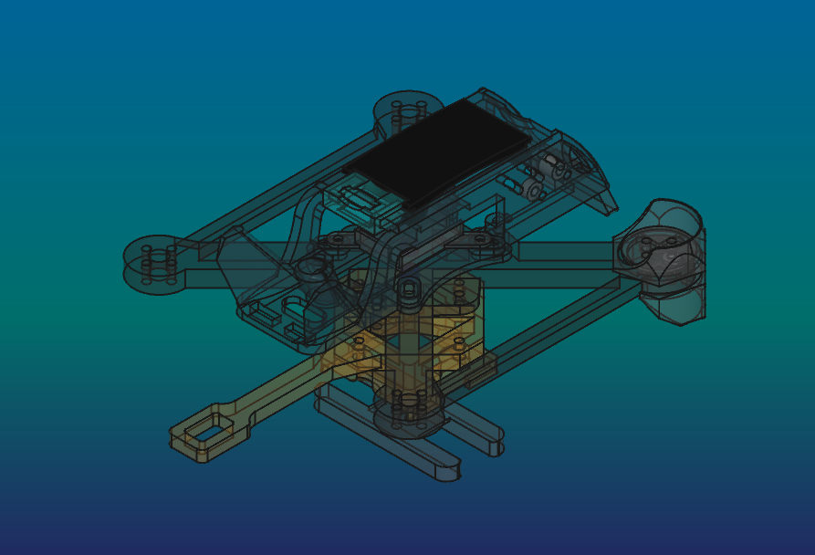
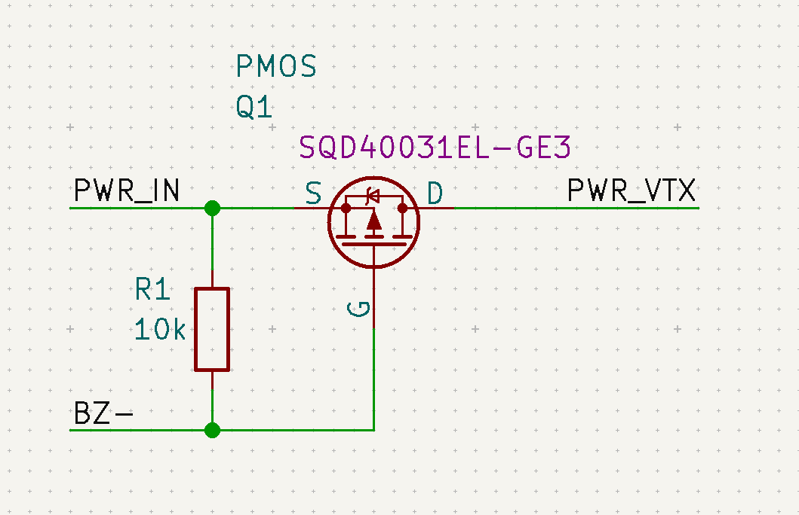

# BD1 "Fury" repo

**Fury is 3" sub250 freestyle type drone, for 3S/4S batteries, with fully 3D printed construction**

 

*Speed can be reduced in edgeTX system using logical switch based on the speed read from GNSS, and the mix function. The project includes a configuration that limits the speed when SB is UP*

## 3D printing

All on 0.4 brass nozzle, make sure you have at least 5 pieces- CF filaments will wear off quickly. Trim Z-offset after every CF print

I don't recommend using SS nozzle becouse it's too cold for my printer.

### tips/info
>please use proper materials. Drone components will be hot or very hot. Printing parts with PLA or similar will cause melt your construction during flight. **If my cheap Sidewinder X4 printer can handle this materials- yours printer also can.**

>It's not cheap project- don't do it because of lack of funds. Buying a ready frame will be cheaper than buying CF filaments

>one battery for one 2-3 minutes flight. Make sure you have more than 1

### parts
- **body**
: PA12
- **bottom**
: PA12
- **bumper**
: PP/TPU A95
- **Sleeves**
: PETG
- **foot**
: PA12
- **frame**
: PC-CF/PETG-CF/PAHT-CF, 3 wall loops, no supports, 100% grid infill, rotate 15deg in Z axis
- **light plate**
: TPU A95
- **motor screw shim**
: PC
- **roof**
: TPU A95 / PP
- **top lock**
: PETG
- **VTX adapter**
: TPU A95

## BOM

### 3D printed
- 1 x body
- 1 x bottom
- 4 x bumpers(optional)
- 2 x camera sleeves
- 4 x sleeve 2mm
- 4 x sleeve 3mm
- 16 x 1.2mm sleeve for frame30 (optional)
- 1 x foot(optional)
- 1 x frame
- 1 x light plate
- 1 x motor screw shim
- 1 x roof
- 1 x top lock
- 1x VTX adapter (optional)

### electronic
- [ ] **FC**
: GEPRC TAKER G4 35A AIO
>you can use any other 35A+, compatible with 3/4S and 25,5mm pitch
- [ ] **propellers 3"**
: HQPROP T3X1.8X3 / HQPROP T3X3
- [ ] **motors 3"**
: flyfishRC FLASH 1404 4500KV
- [ ] **receiver**
: SpeedyBee Nano 2.4G ExpressLRS ELRS Receiver
>or any other ELRS receiver which can fit into modules mounts in body
- [ ] **camera analog**
: CADDX Ratel Pro
- [ ] **VTX analog**
: TBS Unify Pro32 Nano 5G8
- [ ] **Camera + VTX digital**
: BETAFPV P1 Air unit
- [ ] **battery 3"**
: LAVA II 4S 680mAh 95C
- [ ] **GNSS**
: Foxeer M10Q-180 compass- mount on **right** fame spoke, faced antenna up and socket left(to body)
- [ ] **Controller**
: RM Pocket, or any other with ELRS and edgeTX
- [ ] **Goggles**
: EMAX Transporter II
- [ ] **VRX antenna**
: Any
- [ ] **Charger**
: iMax B6 V2 with some 12V supplier / ToolkitRC Q4AC
- [ ] **4x RGB LED**
: if you want make night flies
- [ ] **2 x additional XT30 connectors set**
: to connect battery to charger and FC
- [ ] **red and black 18AWG silicon wire cables**
: to make connection with FC
- [ ] **14x9x5 (diameter * hole * height) ferrite ring**
: turn 3-4x GNSS cable as close as possible to GNSS modulestabilizer

### mechanical

- [ ] 1x 10x130-150mm battery velcro strap
- [ ] 8x 20mm M2 screws with barrel head for stack mount
- [ ] 4x 10mm M2 screws with barrel head for body mount
- [ ] 8x M2 H3 D3.6mm brass insert
- [ ] 2-4x M2 1,6mm nut to lock stack screws
- [ ] 4x M2 20mm PA screws to mount digital VTX
- [ ] 4x M2 0,8mm nut to screw in digital VTX
- [ ] 16x M2 8mm screws for frame30
- [ ] 16x M2 10mm screws for frame30 with motor screw shims

## electronics
project contains configuration for HD version with BZ- pin used as VTX power switch. Implementation below:

## firmware
If you are building remotely:
> choose analog OSD Protocol and type **OSD_HD** in custom defines, to build firmware with both- digital and analog OSD 
> In other options add **Magnetometers**, **Position Hold** and **Altitude Hold**

**Thanks Baro for PID tunes!!**

Firmware notice

This repository may include firmware binaries and configuration files for flight controllers and ESCs.

Betaflight firmware is licensed under the GNU General Public License v3.0 (GPL-3.0).
Source code is available at: https://github.com/betaflight/betaflight

Bluejay ESC firmware is licensed under the GNU General Public License v3.0 (GPL-3.0).
Source code is available at: https://github.com/bird-sanctuary/bluejay

All respective rights belong to the original authors and contributors.
This repository does not claim ownership of these projects and only redistributes unmodified binaries for convenience.

Binaries are named with their version, target and build identifier where applicable.

*BD1 stands for "Bart's Design 1"*
